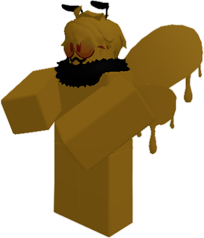

# **Infected Types:**

- [**Infected Types:**](#infected-types)
  - [**Normal Infected:**](#normal-infected)
    - [Bat Infected:](#bat-infected)
    - [Bee Infected:](#bee-infected)
    - [Cat:](#cat)
    - [Deer:](#deer)
    - [Dragon:](#dragon)
    - [Fox:](#fox)
    - [Hedgehog:](#hedgehog)
    - [Moth:](#moth)
    - [Rat:](#rat)
    - [Sheep:](#sheep)
    - [Shark:](#shark)
    - [Squirrel:](#squirrel)
    - [Wolf:](#wolf)
    - [Wyvern:](#wyvern)
    - [Void Walker:](#void-walker)

## **Normal Infected:**

---

### Bat Infected:

---

  
Damage: 1

  
Health: 1 

  
Jump: 1.2 
 
  
Speed: 1.05 

---

### Bee Infected:

<strong>The Bee's jump is low because it glides and does not jump.</strong>

---

  
Damage: 1.35

  
Health: 0.85 

  
Jump: 0.25 
 
  
Speed: 1 

---

### Cat:

### Deer:

### Dragon:

### Fox:

### Hedgehog:

### Moth:

### Rat:

### Sheep:

### Shark:

### Squirrel:

### Wolf:

### Wyvern:

### Void Walker:

&nbsp;

&nbsp;

&nbsp;

---

To get back to the main page click <a href="../Unstable-Labs">this!</a>